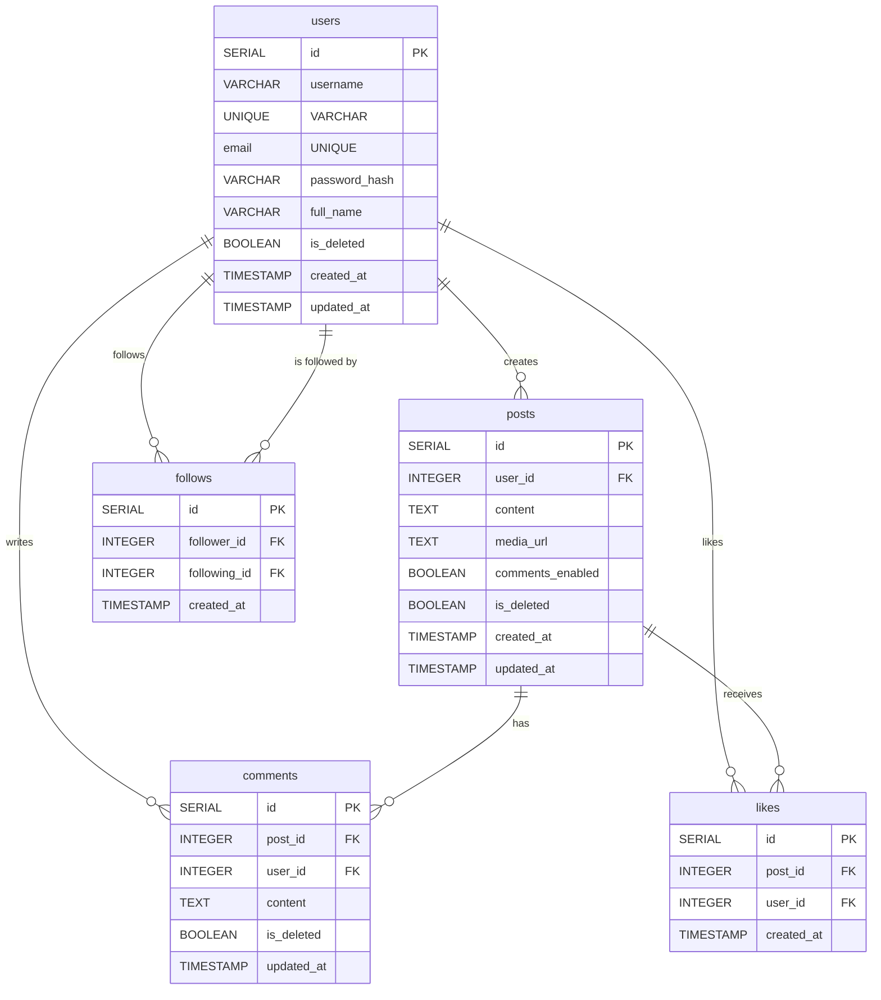

# Social Media Backend

A Node.js backend API for a social media platform with user authentication, content creation, and social features.

## Entity Relationship Diagram (ERD)

Below is the ER diagram for the main entities in the project:



## Setup Instructions

1. Install dependencies:

    ```bash
    npm install
    ```

2. Create a `.env` file in the root directory with the following variables:

    ```
    PORT=3000
    DB_HOST=localhost
    DB_PORT=5432
    DB_NAME=social_media_db
    DB_USER=your_db_user
    DB_PASSWORD=your_db_password
    JWT_SECRET=your_jwt_secret_key
    ```

3. Set up PostgreSQL database and run the setup script:
    ```bash
    npm run setup:db
    ```

## How to Run

### Development mode with auto-reload:

```bash
npm run dev
```

### Production mode:

```bash
npm start
```

## Available npm Scripts

-   `npm start` - Start the application in production mode
-   `npm run dev` - Start the application in development mode with nodemon
-   `npm run start:verbose` - Start with verbose logging
-   `npm run start:critical` - Start with critical-only logging
-   `npm run setup:db` - Set up database tables
